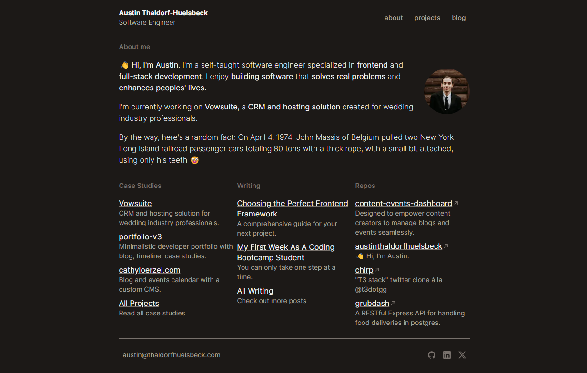
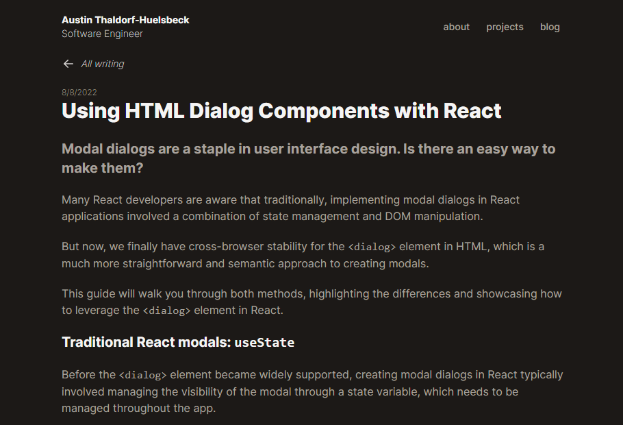

# Developer Portfolio

## Table of Contents
- [Description](#description)
- [Features](#features)
- [Prerequisites](#prerequisites)
- [Installation](#installation)
- [Usage](#usage)
- [Contributing](#contributing)
- [License](#license)
- [Credits](#credits)
- [Screenshots](#screenshots)
- [Contact](#contact)

## Description
This portfolio is bootstrapped with [create-t3-app](https://create.t3.gg/), leveraging [Next.js](https://nextjs.org), TypeScript, [Tailwind CSS](https://tailwindcss.com), [Prisma](https://prisma.io), and [tRPC](https://trpc.io). It features content management through markdown with [remark/rehype](https://github.com/remarkjs/remark-rehype) and [gray-matter](https://www.npmjs.com/package/gray-matter), converting markdown in the `public` directory to styled HTML.

## Features
- Projects section with case studies.
- Blog with markdown integration for easy post management.
- GitHub repository display.
- Random fact feature on the homepage (optional, via API Ninjas).
- Server-side rendering with loading indicators.

## Prerequisites
- Node.js
- A MySQL database

## Installation
1. Clone the repo and navigate to it.
2. Create a `.env` file:

```
DATABASE_URL=your_mysql_db_public_url
```

For the random fact feature:

```
API_NINJAS_API_KEY=your_apininjas_api_key
```

3. Install dependencies:

```
npm install
```

4. Set up the database:

```
npx prisma db push
npx prisma db generate
```

5. Start the server and client:

npm start

6. Launch Prisma Studio:

```
npx prisma studio
```

7. Access the portfolio at `localhost:3000` and Prisma Studio at `localhost:5555`.

## Usage
Organize content in the `public` directory. Edit markdown files in `blogs`, `markdown/posts`, `markdown/projects`, and `markdown/resume`. Customize `social` and `technologies` with your own SVG icons.

Follow the t3 deployment guides for [Vercel](https://create.t3.gg/en/deployment/vercel), [Netlify](https://create.t3.gg/en/deployment/netlify) and [Docker](https://create.t3.gg/en/deployment/docker) for more information on deploying your portfolio.

## Contributing
Contributions are welcome. For major changes, please open an issue first. Fork the repo, create your feature branch, commit your changes, and open a pull request.

## License
This project is licensed under the MIT License.

## Credits
Thanks to Theo Browne (@t3dotgg) for the create-t3-app framework and the "chirp" tutorial.

## Screenshots

Portfolio Overview:



Blog Section:



## Contact
For queries, suggestions, or collaboration, reach out through GitHub. Contact information is available on the portfolio.
